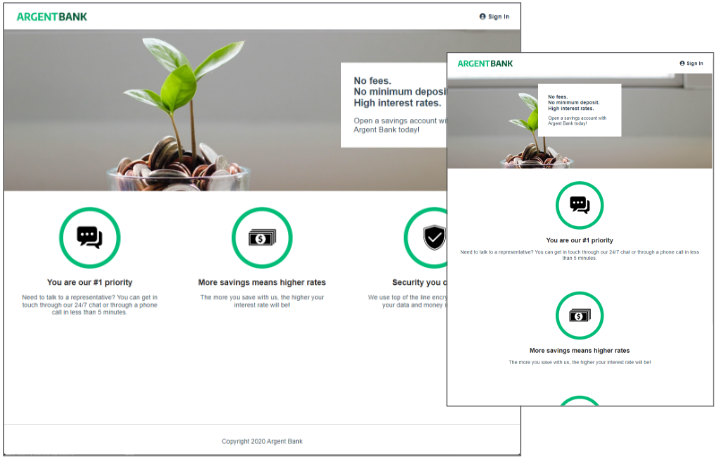

Openclassrooms Projet 13 : Utilisez une API pour un compte utilisateur bancaire avec React - Site ArgentBank

Le contexte du projet :

- Mon profil : développeur front-end chez Remede Agency.
- L’entreprise : une agence spécialisée dans le développement d’application web.
- La mission : aider la banque Argent Bank à mettre en place son application.
- L’objectif :
  - Création d'une application web permettant aux clients de se connecter et de gérer leurs comptes et leur profil.
  - Spécifier les endpoints d’API nécessaires pour une éventuelle deuxième mission.

Cahier des charges :

- Spécifications techniques :
  - Phase 1 :
    - Développer une application web complète et responsive avec React.
    - Exploiter les API fournies par le back-end (documentation Swagger disponible).
    - Utilisation de Redux pour gérer le state de l’ensemble de l’application.
  - Phase 2 :
    - Proposer une modélisation côté back-end des API pour les transactions.
    - Fournir la documentation Swagger qui précise :
      - La méthode
      - Les routes
      - La description
      - Les paramètres et réponses
- Spécifications fonctionnelles :
  - Phase 1 :
    - L'utilisateur peut visiter la page d'accueil.
    - L'utilisateur peut se connecter au système.
    - L'utilisateur peut se déconnecter du système.
    - L'utilisateur ne peut voir les informations relatives à son propre profil qu'après s'être connecté avec succès.
    - L'utilisateur peut modifier le profil et conserver les données dans la base de données.
  - Phase 2 :
    - Permettre de visualiser toutes leurs transactions pour le mois en cours.
    - Permettre de visualiser les détails d'une transaction dans une autre vue.
    - Permettre d'ajouter, de modifier ou de supprimer des informations sur une transaction.

# Getting Started with Create React App

This project was bootstrapped with [Create React App](https://github.com/facebook/create-react-app).

## Available Scripts

In the project directory, you can run:

### `yarn start`

Runs the app in the development mode.\
Open [http://localhost:3000](http://localhost:3000) to view it in your browser.

The page will reload when you make changes.\
You may also see any lint errors in the console.

### `yarn test`

Launches the test runner in the interactive watch mode.\
See the section about [running tests](https://facebook.github.io/create-react-app/docs/running-tests) for more information.

### `yarn build`

Builds the app for production to the `build` folder.\
It correctly bundles React in production mode and optimizes the build for the best performance.

The build is minified and the filenames include the hashes.\
Your app is ready to be deployed!

See the section about [deployment](https://facebook.github.io/create-react-app/docs/deployment) for more information.

### `yarn eject`

**Note: this is a one-way operation. Once you `eject`, you can't go back!**

If you aren't satisfied with the build tool and configuration choices, you can `eject` at any time. This command will remove the single build dependency from your project.

Instead, it will copy all the configuration files and the transitive dependencies (webpack, Babel, ESLint, etc) right into your project so you have full control over them. All of the commands except `eject` will still work, but they will point to the copied scripts so you can tweak them. At this point you're on your own.

You don't have to ever use `eject`. The curated feature set is suitable for small and middle deployments, and you shouldn't feel obligated to use this feature. However we understand that this tool wouldn't be useful if you couldn't customize it when you are ready for it.

## Learn More

You can learn more in the [Create React App documentation](https://facebook.github.io/create-react-app/docs/getting-started).

To learn React, check out the [React documentation](https://reactjs.org/).

### Code Splitting

This section has moved here: [https://facebook.github.io/create-react-app/docs/code-splitting](https://facebook.github.io/create-react-app/docs/code-splitting)

### Analyzing the Bundle Size

This section has moved here: [https://facebook.github.io/create-react-app/docs/analyzing-the-bundle-size](https://facebook.github.io/create-react-app/docs/analyzing-the-bundle-size)

### Making a Progressive Web App

This section has moved here: [https://facebook.github.io/create-react-app/docs/making-a-progressive-web-app](https://facebook.github.io/create-react-app/docs/making-a-progressive-web-app)

### Advanced Configuration

This section has moved here: [https://facebook.github.io/create-react-app/docs/advanced-configuration](https://facebook.github.io/create-react-app/docs/advanced-configuration)

### Deployment

This section has moved here: [https://facebook.github.io/create-react-app/docs/deployment](https://facebook.github.io/create-react-app/docs/deployment)

### `yarn build` fails to minify

This section has moved here: [https://facebook.github.io/create-react-app/docs/troubleshooting#npm-run-build-fails-to-minify](https://facebook.github.io/create-react-app/docs/troubleshooting#npm-run-build-fails-to-minify)
